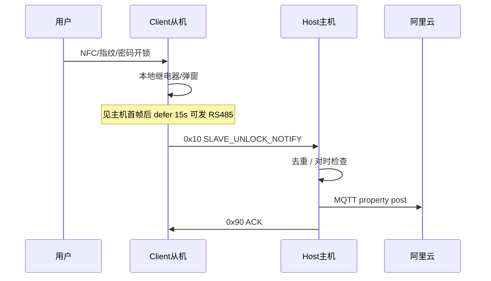

# modelkey ― STM32F407 双机智能门锁

基于 **STM32F407** 的主从双板方案：一块 **Host（主机）** 负责触摸屏、WiFi、阿里云 MQTT、用户管理与云端上报；一块 **Client（从机）** 负责本地开锁（密码 / NFC / 指纹），并通过 **RS485** 把开锁记录同步给主机上云。

| 目录 | 角色 | 主要能力 |
|------|------|----------|
| [`Host/`](Host/) | 主控 | LVGL UI、ESP8266、阿里云 MQTT、NFC/指纹、RS485 主站、用户镜像下发 |
| [`Client/`](Client/) | 从机 | 开锁页 UI、NFC/指纹/密码、RS485 从站、开锁事件上报主机 |
| [`Host/test/`](Host/test/) | 硬件测试 | NFC + RS485 单项联调（独立 Keil 工程） |
| [`Client/test/`](Client/test/) | 硬件测试 | 与 Host 测试同结构的从机侧工程 |

---

## 功能概览

- **本地开锁**：密码、NFC（MFRC522）、指纹（AS608）
- **双机 RS485**：主机同步用户/指纹模板；从机上报开锁通知（`0x10`）
- **阿里云 IoT**：物模型属性上报 `unlock_account`、`unlock_time`、`unlock_method`、**`unlock_device`**（1=主机，2=从机）
- **时间同步**：MQTT NTP（推荐）；未对时前主机记录可入 Flash 队列，从机记录在主机未对时时按策略丢弃
- **FreeRTOS + LVGL**：双任务分离 UI / 云端 / NFC / 指纹 / RS485

---

## 硬件与引脚（摘要）

两块板子 MCU 相同，通过 **`app_config.h` 中 `APP_RS485_NODE_ROLE`** 区分固件角色。

| 接口 | 主机 / 从机（典型） |
|------|---------------------|
| 调试串口 | USART1 **PA9/PA10**，115200（`APP_DEBUG_ON_USART6=0` 时） |
| RS485 | USART6 **PC6(TX) PC7(RX) PC8(DE+RE)**，115200，地址主机 `0x01` / 从机 `0x02` |
| ESP8266（仅 Host） | USART2 PA2/PA3，RST PA8 |
| AS608 指纹 | USART3 PB10/PB11 |
| NFC MFRC522 | SPI + 相关 GPIO（见 BSP） |
| 触摸 | FT6336（I2C PB6/PB7 等，与 Guider 工程一致） |

接线、电源、RS485 A/B 与 GND 共地请按实际 PCB 核对。

---

## 快速开始

### 环境

- **Keil MDK-ARM** V5.x（工程内标注为 ARM Compiler 5）
- **STM32F407** 目标芯片（工程名 `stm32f407vet6`）
- 可选：ST-Link / J-Link 下载调试

### 编译与烧录

| 固件 | Keil 工程路径 |
|------|----------------|
| **主机** | [`Host/Projects/MDK-ARM/stm32f407_lvglport.uvprojx`](Host/Projects/MDK-ARM/stm32f407_lvglport.uvprojx) |
| **从机** | [`Client/Projects/MDK-ARM/stm32f407_lvglport.uvprojx`](Client/Projects/MDK-ARM/stm32f407_lvglport.uvprojx) |
| NFC+RS485 测试（Host） | [`Host/test/nfc_enroll_rs485/MDK-ARM/nfc_enroll_test.uvprojx`](Host/test/nfc_enroll_rs485/MDK-ARM/nfc_enroll_test.uvprojx) |

1. 用 Keil 打开对应 `.uvprojx`
2. 确认 **Target** 为 `stm32f407vet6`
3. **Rebuild** → 生成 `Output/atk_f407.hex`（`Output/` 已在 `.gitignore` 中，不提交仓库）
4. 分别烧录到主机板、从机板

### 主机 / 从机如何切换

同一套代码树，**只改一处宏**（各工程自己的 `User/app_config.h`）：

```c
/* Client/User/app_config.h ― 从机固件 */
#define APP_RS485_NODE_ROLE      APP_RS485_ROLE_SLAVE

/* Host/User/app_config.h ― 主机固件 */
#define APP_RS485_NODE_ROLE      APP_RS485_ROLE_MASTER
```

- 从机：`APP_CLOUD_ENABLE = 0`，无 WiFi 完整流程，开锁经 RS485 通知主机
- 主机：`APP_RS485_ENABLE = 1`，负责 MQTT 与从机通信

---

## 阿里云配置（主机）

在 [`Host/User/app_config.h`](Host/User/app_config.h) 中填写（**勿将真实密钥提交到公开仓库**）：

- `APP_ALIYUN_PRODUCT_KEY` / `APP_ALIYUN_DEVICE_NAME` / `APP_ALIYUN_DEVICE_SECRET`
- `APP_ALIYUN_MQTT_PASSWORD`（HMAC-SHA1 十六进制大写）
- WiFi：可在 UI 中扫描连接，或使用 `app_wifi_remember` 记忆热点

物模型上报示例字段：

| 属性 | 说明 |
|------|------|
| `unlock_account` | 账号字符串 |
| `unlock_time` | `YYYY.MM.DD HH:MM`（对时后） |
| `unlock_method` | 1=密码，2=NFC，3=指纹 |
| `unlock_device` | **1=主机开锁**，**2=从机开锁** |

---

## RS485 从机开锁上云流程



相关配置（从机 [`Client/User/app_config.h`](Client/User/app_config.h)）：

| 宏 | 默认值 | 含义 |
|----|--------|------|
| `APP_SLAVE_UNLOCK_DEFER_RS485_MS` | 15000 | 收到主机首帧后再等待多久才允许发开锁通知 |
| `APP_SLAVE_UNLOCK_NO_HOST_FALLBACK_MS` | 120000 | 从未收到主机时最长等待后仍尝试上报 |
| `APP_FP_SLAVE_MATCH_VIA_HOST` | 1 | 指纹优先送主机比对 |
| `APP_FP_SLAVE_MATCH_FALLBACK` | 1 | 主机失败则本地 AS608 搜索 |

---

## 调试串口日志开关

正式版本默认 **关闭** 诊断打印，需要联调时在对应 `app_config.h` 中改为 `1`：

| 宏 | 工程 | 作用 |
|----|------|------|
| `APP_HOST_SLAVE_UNLOCK_CLOUD_TRACE` | Host | `[UNLOCK]` 从机上报 / 去重 / 上云 |
| `APP_SLAVE_UNLOCK_CLOUD_TRACE` | Client | `[SLV][UNLOCK]` / `[SLV][HOST]` |
| `APP_SLAVE_NFC_UNLOCK_TRACE` | Client | `[SLV][NFC]` 刷卡流程 |
| `APP_WIFI_CWJAP_TRACE` / `APP_CLOUD_TRACE` / `APP_TIME_TRACE` | Host | WiFi / 云 / 对时 |
| `APP_HOST_RS485_DIAG` | Host | RS485 帧级日志 |
| `APP_FP_MIRROR_DIAG` | 双机 | 指纹镜像 |
| `APP_SLAVE_USART1_DEBUG` | Client | 从机详细调试（含启动行） |

调试口：**115200 8N1**，USART1 PA9(TX)/PA10(RX)（默认）。

---

## 清理编译产物

各工程目录下的 `keilkill.bat` 可删除 `Output/`、`*.uvguix*` 等本地文件：

```bat
cd Host\Projects\MDK-ARM
keilkill.bat
```

---

## 仓库结构（逻辑分层）

```
modelkey/
├── Host/
│   ├── User/           # 应用逻辑（云端、RS485 主站、UI 流程）
│   ├── Drivers/        # HAL + BSP（LCD、触摸、NFC、AS608…）
│   ├── guider/         # LVGL Guider 生成 UI
│   ├── Middlewares/    # FreeRTOS、LVGL
│   └── Projects/MDK-ARM/
├── Client/             # 结构同 Host，配置为从机
├── CHANGELOG.md        # 版本更新记录（中文）
└── README.md           # 本文件
```

---

## 版本与发布

| 资源 | 链接 |
|------|------|
| 更新记录 | [CHANGELOG.md](./CHANGELOG.md) |
| GitHub 仓库 | https://github.com/dtrh235/-stm32f407- |
| Releases | https://github.com/dtrh235/-stm32f407-/releases |

当前主线版本：**v1.4.0**（见 CHANGELOG）

---

## 常见问题

**Q：从机开锁了但云端没有记录？**  
- 确认主机 WiFi/MQTT 已连、NTP 已对时（主机日志可临时开 `APP_TIME_TRACE`）  
- 从机是否在 **defer 15s** 之后才发 RS485；主机是否收到 `0x10`（开 `APP_HOST_SLAVE_UNLOCK_CLOUD_TRACE`）  
- 早期版本从机 ACK 未识别会导致重复上报；v1.4.0 已修复 RS485 ACK 与主机 3s 去重  

**Q：云端「开锁设备」一直显示 1？**  
- v1.4.0 起 MQTT JSON 已包含 `unlock_device`；请确认主机固件为该版本及以上  

**Q：从机 NFC 无反应？**  
- 须在 **screen_1 开锁页**；用户/NFC 需经主机 RS485 镜像同步（`users` 表）  
- 可开 `APP_SLAVE_NFC_UNLOCK_TRACE` 查看 `skip` / `no_match` 原因  

**Q：Keil 编译报缺字体或图片？**  
- 勿删除 `guider/generated/` 下 **已列入 uvprojx** 或 **`gui_guider.c` #include** 的文件；仅删除确认未引用的 orphan 资源  

---

## 许可与贡献

固件与文档仅供学习与项目维护使用。提交 PR 前请避免上传真实 **DeviceSecret / WiFi 密码**；建议使用本地 `app_config.local.h` 或私有配置覆盖（若后续添加）。

如有问题，请通过 GitHub **Issues** 反馈，并附上 Host/Client 版本、现象与必要的串口日志（脱敏后）。
