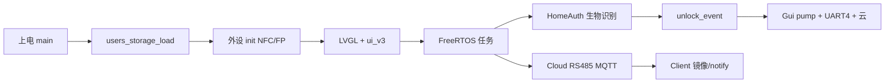

# 第 19 课：难点与易错点总复习

> **阶段**：收官 | **建议课时**：3～4 小时

---

## 上节复习

- 五层排障模型 L0～L5
- 串口与调试宏选用

**预习下节（第 20 课）**：简历写法与模拟面试题。

---

## 十大难点（考前必背）

| # | 难点 | 关键词 | 相关文件 |
|---|------|--------|----------|
| 1 | 启动顺序 | W25Q 先于 LVGL；JTAG 释放 PA15 | `main.c`、`bsp_w25q16.c` |
| 2 | 多 SPI 设备 | SPI1 屏 vs 软 SPI Flash/NFC | `lcd.c`、`bsp_w25q16.c`、`MFRC522.c` |
| 3 | GUI 线程安全 | 开锁弹窗必须 gui_pump | `app_unlock_event.c` |
| 4 | RS485 半双工 | DE + POST_TX_GAP | `app_rs485_link.c` |
| 5 | 指纹分片镜像 | 512B/4 片 + gap | `app_fp_mirror_tx.c` |
| 6 | 代匹配 | 用户表只在主机 | `app_fp_host_match.c` |
| 7 | AT 状态机 | UART2 互斥 | `cloud_aliyun_at.c` |
| 8 | Flash 异步写 | StorageTask | `app_user_ops.c` |
| 9 | 主从双镜像 | 烧错角色 | `app_config.h` |
| 10 | ui_v3 状态机 | 导航栈 + 旧 screen 共存 | `ui_v3/*` |

---

## 易错点清单（按模块）

### 硬件接线

- 测试 W25Q **PE0** vs 主工程 **PA15**
- RS485 无共地 → 偶发 CRC 错
- MFRC522 未软复位 → 有版本无读卡

### 软件操作

- 首页开锁须**双击**
- 录入中首页仍轮询 NFC/指纹 → 应被 `app_enroll_flow_active` 挡住
- Client 烧 Host 固件

### 云端

- Topic 未配置产品流转
- 物模型字段与固件 JSON 不一致
- `.env` 密钥泄露

---

## 知识串联图

---

## 综合复习题

1. 画出从「侧门刷 NFC」到「App 出现记录」的模块图。
2. 列举三类不能在中断/CloudTask 里直接做的事。
3. 为什么测试工程与主工程 W25Q CS 不同仍能学同一套驱动？
4. `APP_FP_SLAVE_MATCH_VIA_HOST=0` 会怎样？
5. 改 `user_cred_t` 结构体为什么要同时改 RS485 协议？

---

## 综合复习题参考答案

1. Client NFC 读 UID → 本地鉴权 → RS485 `SLAVE_UNLOCK_NOTIFY` → Host 解析 → `cloud_ota_service` publish → 后端 → App。
2. 调 LVGL UI；长时间阻塞擦 Flash；与另一任务同时向 ESP8266 发 AT。
3. 驱动 API 相同，仅 BSP 引脚宏不同，换 CS 脚即可复用逻辑。
4. 从机本地 AS608 Search，需自行维护 page→账号映射，易与主机用户表不一致。
5. `USER_ADD` 直接传 `user_cred_t` 二进制，布局变化会导致从机解析错乱，必须双端同版本升级。

---

## 本课总结

- 难点集中在**资源争用**和**分布式状态一致**
- 本项目是小型嵌入式产品设计的完整样本
- 复习时以「一条开锁链路」串所有模块

---

## 本课提问

1. 本项目最大的架构特点是什么？（一句话）
2. 若只能保留三个调试手段，你选哪三个？
3. 说出你目前最薄弱的一个模块，并写下对应文件路径。

---

## 参考答案

1. 双机 RS485 协同 + 主机权威数据 + FreeRTOS 多任务 + 云边端闭环。（答出其中两点即合格）
2. 开放题；推荐：`test/test` 自检、`[BOOT]`/`[RS485]` 日志、JoyfulZone 后端。
3. 开放题；诚实标注即可，作为第 20 课面试准备重点。

---

**上一课**：[18-调试方法论.md](./18-调试方法论.md)  
**下一课**：[20-简历呈现与模拟面试.md](./20-简历呈现与模拟面试.md)
